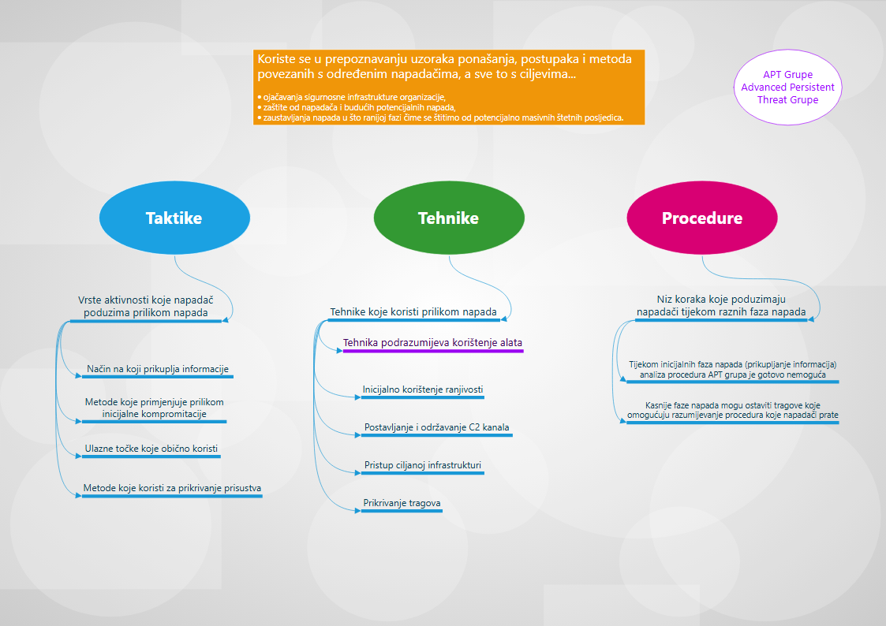

# Taktike, tehnike i procedure (TTP) napadača

* **Svrha analize TTP:**

  * Omogućuje razumijevanje kako napadači djeluju.
  * Pomaže sigurnosnim inženjerima u otkrivanju i ublažavanju napada.

* **Taktike**

  * Definicija: vrste aktivnosti koje napadači koriste za izvođenje napada.
  * Odgovaraju na pitanje **„zašto?“** (cilj aktivnosti).
  * Primjeri:

    * Dobivanje neovlaštenog pristupa osjetljivim podacima.
    * Lateralno (bočno) kretanje unutar mreže.
    * Ugrožavanje web stranice.

* **Tehnike**

  * Definicija: opće metode kojima napadači postižu ciljeve (sredstva za ostvarenje taktike).
  * Odgovaraju na pitanje **„kako?“** (način izvođenja).
  * Svaka taktika može uključivati više tehnika.
  * Primjer: za taktiku kompromitacije web stranice — tehnika **SQL injection**.

* **Procedure (proceduralni koraci)**

  * Definicija: konkretan, korak-po-korak slijed radnji koje napadači koriste za izvršenje tehnike.
  * Primjer (SQL injection procedure):

    * Skeniranje ciljane web stranice za ranjivosti.
    * Pisanje zlonamjernog SQL upita.
    * Slanje upita kroz nezaštićeni obrazac na web stranici radi izvođenja koda i preuzimanja kontrole nad poslužiteljem.

* **Veza između pojmova:**

  * *Taktika* = cilj/namjera (zašto).
  * *Tehnika* = metoda (kako).
  * *Procedura* = konkretni koraci (što točno učiniti).

* **Praktična vrijednost:**

  * Razdvajanje na taktike/tehnike/procedure olakšava otkrivanje obrazaca napada, automatizirano otkrivanje i izradu učinkovitih protumjera.

---

